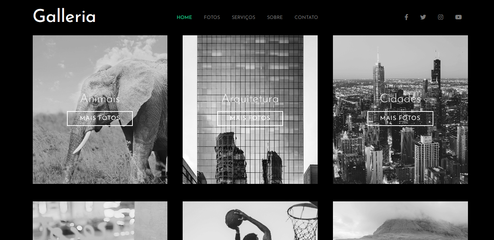
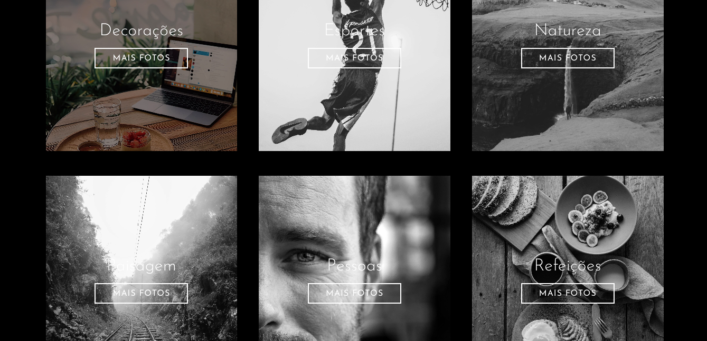

<table align="right">
  <tr>
    <td>
      <a href="readme-en.md">🇺🇸 English</a>
    </td>
  </tr>
  <tr>
    <td>
      <a href="README.md">🇧🇷 Português</a>
    </td>
  </tr>
</table>

# Galleria :framed_picture:
| Link do Projeto { <a href= "https://andrecampelor.github.io/ProjetoGaleria/"> Galleria </a>} |

## Sobre :memo:
Esse projeto foi feito para aplicar o conteudo estudado no curso de Sass do Matheus Battisti.

Que consiste em uma galeria de imagens na qual estão organizadas em albuns de acordo com cada categoria.

## Layout mobile :iphone:

## Layout web :computer:

### Tecnologias utilizadas :rocket:
- HTML
- SASS

### Autor :man_technologist:

André Luiz Campelo

 
