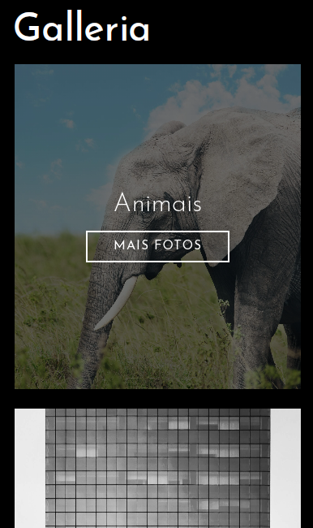
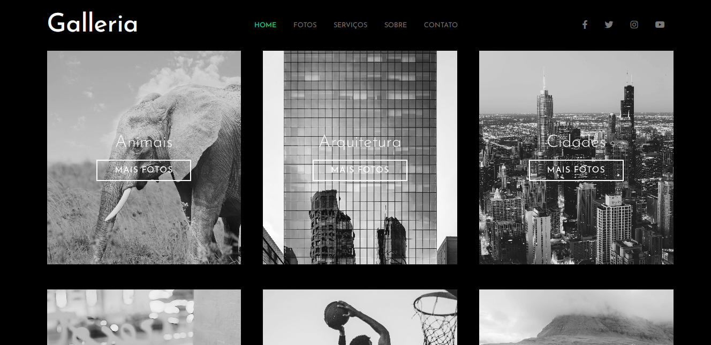
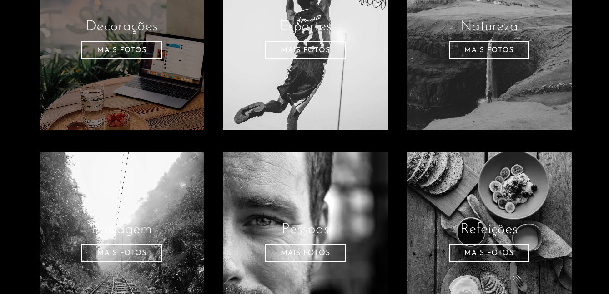

<table align="right">
  <tr>
    <td>
      <a href="readme-en.md">🇺🇸 English</a>
    </td>
  </tr>
  <tr>
    <td>
      <a href="README.md">🇧🇷 Português</a>
    </td>
  </tr>
</table>

# Galleria :framed_picture:
| Project Link { <a href= "https://andrecampelor.github.io/ProjetoGaleria/"> Galleria </a>} |

## About :memo:
This project was made to apply the content studied in Matheus Battisti's Sass course.

Which consists of an image gallery in which are organized into albums according to each category.

## Layout mobile :iphone:

## Layout web :computer:

### Technologies Used :rocket:
- HTML
- SASS

### Author :man_technologist:

André Luiz Campelo

 